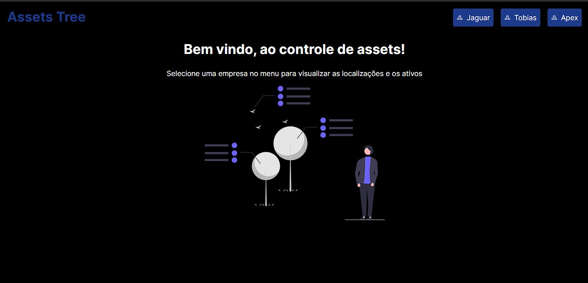

### Assets Tree

#

## Tree View Application that shows companies Assets (The tree is basically composed with components, assets and locations)

# Context

Assets are essential to the operation of the industry, it can include everything from manufacturing equipment to transportation vehicles to power generation systems. Proper management and maintenance is crucial to ensure that they continue to operate efficiently and effectively. A practical way to visualize the hierarchy of assets is through a tree structure.

more in: [link challange](https://github.com/tractian/challenges/blob/main/front-end/README.md)

[text](src/assets/video/video.webm)

# Was built with Next js 14.

# to run just:

`npm i

npm run dev`

# Next steps

# Improve the performace

# build a way to hide locations and assets
